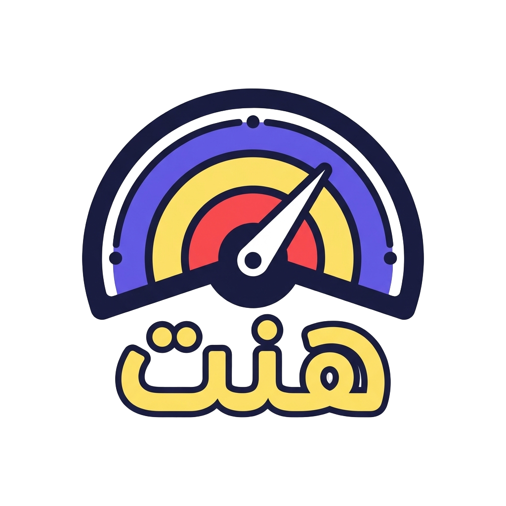
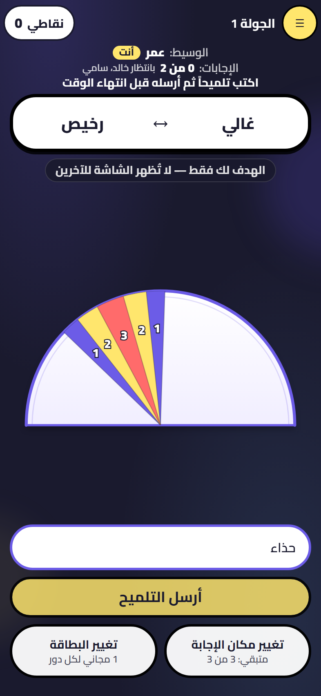
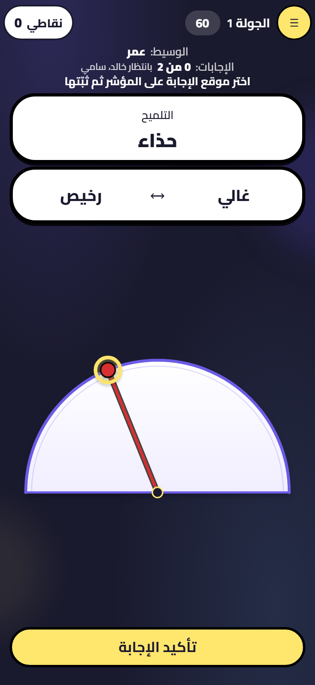
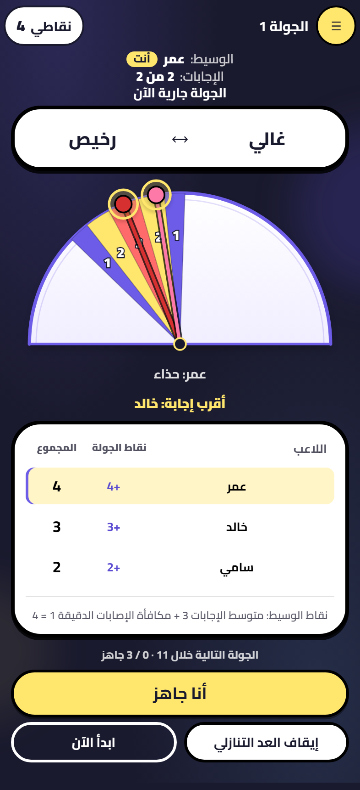

<div align="center">
  
  <h1>Hint · هنت</h1>
  <p>An Arabic multiplayer party game about clues, guesses, and thinking alike.</p>
  <p><a href="https://hint-delta.vercel.app"></a></p>
  <p><a href="#run-locally">Run locally</a> · <a href="docs/TESTING.md">Testing</a></p>
</div>

## How it works

**The card** is a pair of opposites. In the round below it reads **رخيص ↔ غالي** (*cheap ↔ expensive*). Omar is the clue giver: only he sees the colored target on the dial. He types **حذاء** (*shoe*) as his **clue**, hoping the others will picture a shoe at roughly the same price point. Before sending it, he can change the card once this turn or move the target to a different position, with up to three target changes per match.

**The guess:** Khaled and Sami see the card and Omar's clue, but not the target. Each moves his needle to the price he imagines.

**The reveal:** The target and both guesses appear on the dial. The colored bands show how close each guess landed; the table shows points for the round and the running totals.

<table>
  <tr>
    <td align="center"></td>
    <td align="center"></td>
    <td align="center"></td>
  </tr>
  <tr>
    <td align="center"><strong>1. Card and clue</strong></td>
    <td align="center"><strong>2. Guess from the clue</strong></td>
    <td align="center"><strong>3. Reveal and score</strong></td>
  </tr>
</table>

_Screenshots from one local demo round with fictional players. The game interface is in Arabic._

## Features

- **Play with friends:** rooms for up to 12 players, individual or team mode.
- **Team turns:** custom team names and a designated player who controls the needle.
- **Learn by playing:** an interactive walkthrough and practice rounds.
- **Made for phones:** Arabic right-to-left layout, touch controls, and an installable PWA.
- **Stay in the game:** reconnect to your seat, watch as a spectator, and vote for a rematch.
- **155 cards** across three packs, with one free card change per turn and up to three answer-position changes per match.
- **Animated reveals** bring the target, guesses, and scores onto the same dial.

Multiplayer needs a connection. After an online visit, the cached app also supports offline practice.

## Possible next steps

These are ideas for future versions, not announced features or a release schedule:

- More curated Arabic cards and themed packs.
- More ways to customize matches, especially for teams and larger groups.
- A richer end-of-game recap and continued polish for phones and accessibility.

## Built with

**React · TypeScript · Vite · Node.js · Express · Socket.IO · Playwright**

The server owns room state, scoring, timers, and private targets. The browser renders the game
and sends player actions through shared typed contracts. Tests cover game rules, reconnection,
mobile interactions, and browser journeys in Chromium and WebKit.

## Run locally

Requires **Node.js 24** and **npm 11**. Download or clone this repository, then run these commands from its root. No account, API key, or database is needed for local play.

```sh
npm run install:all
npm run dev
```

Open **http://localhost:5173**. Use another browser or a private window to join as a second player.

For phone testing, environment variables, and checks, see the [setup guide](docs/SETUP.md).
Rooms use memory by default and reset when the server restarts; Redis persistence is optional.

## Explore the project

| Folder             | Responsibility                                          |
| ------------------ | ------------------------------------------------------- |
| [client/](client/) | Game UI, session recovery, and PWA                      |
| [server/](server/) | Multiplayer rooms, rules, scoring, and timers           |
| [shared/](shared/) | Event contracts, validation schemas, and shared scoring |
| [e2e/](e2e/)       | Browser and multiplayer tests                           |

See the [setup guide](docs/SETUP.md) and [testing guide](docs/TESTING.md).
